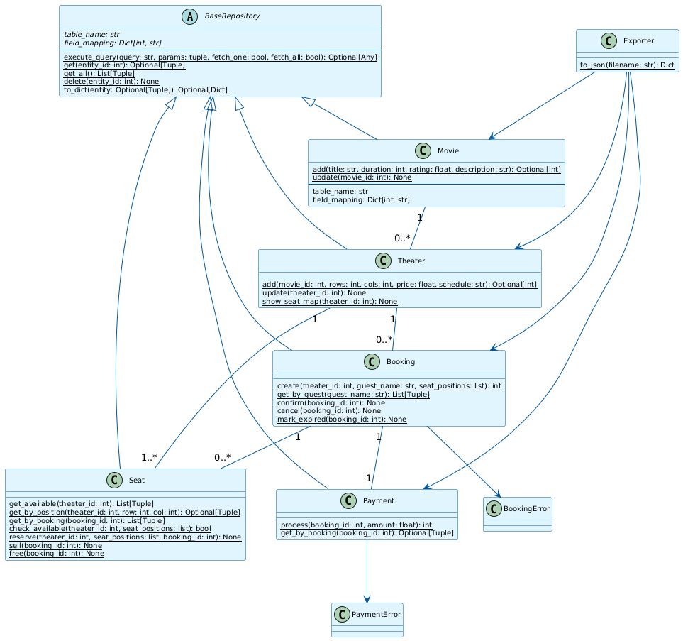

# Cinema Ticket Booking System

Система для бронирования билетов в кинотеатр. Проект на Python с использованием SQLite и принципов ООП.

## Описание

Учебный проект, который показывает:
- Наследование (базовый класс `BaseRepository`)
- Полиморфизм и абстракции
- Паттерн Repository для работы с БД
- Обработку исключений
- Модульное тестирование (unittest)
- Заполнение БД тестовыми данными через Faker

## Функциональность

- Управление фильмами (создание, просмотр, обновление, удаление)
- Управление залами и сеансами (ряды, места, цена, расписание)
- Бронирование билетов:
  - резервирование мест
  - проверка доступности (нельзя забронировать занятое место)
- Платежи по бронированиям:
  - проверка суммы
  - генерация `transaction_id`
  - статус платежа
- Статусы бронирования:
  - `pending`
  - `confirmed`
  - `cancelled`
  - `expired`
- Экспорт данных в JSON (`cinema_data.json`)
- Автоматическое заполнение БД случайными фильмами и сеансами через Faker

## Структура проекта

```
project/
├── db_init.py          # Инициализация БД и контекстный менеджер
├── base_repository.py  # Базовый класс для CRUD операций
├── models.py           # Классы Movie и Seat
├── theater.py          # Класс Theater (залы и сеансы)
├── booking.py          # Класс Booking (бронирования)
├── payments.py         # Класс Payment (платежи)
├── exceptions.py       # BookingError, PaymentError
├── exportio.py         # Экспорт данных в JSON
├── seed_data.py        # Заполнение БД тестовыми данными через Faker
├── maindemo.py         # Демонстрационный сценарий
├── requirements.txt    # Зависимости проекта
├── README.md           # Описание проекта
├── uml_diagram.png     # UML диаграмма классов
└── tests/              # Тесты (unittest)
    ├── __init__.py
    ├── conftest.py
    ├── test_movie.py
    ├── test_seat.py
    ├── test_theater.py
    ├── test_booking.py
    └── test_payment.py
```

## Установка и запуск

### Требования

- Python 3.8+
- pip

### Установка зависимостей

```bash
pip install -r requirements.txt
```

### Запуск основного сценария

```bash
python maindemo.py
```

Скрипт `maindemo.py`:
1. Создаёт БД и таблицы
2. Добавляет фильм «Аватар 3»
3. Создаёт сеанс с местами
4. Дополнительно заполняет БД фильмами и сеансами через Faker
5. Создаёт бронирование, обрабатывает платёж и подтверждает его
6. Показывает схему мест
7. Экспортирует данные в `cinema_data.json`

## Запуск тестов

```bash
pytest tests/ -v
```

## Примеры использования

```python
from logica import Movie
from theater import Theater
from booking import Booking
from payments import Payment

# Создание фильма
movie_id = Movie.add(
    title="Название фильма",
    duration=120,
    rating=8.5,
    description="Краткое описание",
)

# Создание сеанса
theater_id = Theater.add(
    movie_id=movie_id,
    rows=5,
    cols=8,
    price=250.0,
    schedule="2025-01-01T18:00:00",
)

# Бронирование мест
booking_id = Booking.create(
    theater_id=theater_id,
    guest_name="Иван Петров",
    seat_positions=[(1, 1), (1, 2)],
    guest_email="ivan@example.com",
)

# Оплата и подтверждение
booking_row = Booking().get(booking_id)
Payment.process(booking_id=booking_id, amount=booking_row[5])
Booking.confirm(booking_id)
```

## UML диаграмма



Диаграмма показывает:
- Иерархию классов (наследование)
- Связи между классами (ассоциации)
- Методы и атрибуты каждого класса

## Классы и их роль

| Класс | Описание |
|-------|----------|
| `BaseRepository` | Базовый класс для работы с БД (CRUD операции) |
| `Movie` | Управление фильмами |
| `Seat` | Управление местами (статусы: free, reserved, sold) |
| `Theater` | Управление залами и сеансами |
| `Booking` | Управление бронированиями (статусы: pending, confirmed, cancelled, expired) |
| `Payment` | Управление платежами |
| `Exporter` | Экспорт данных в JSON |
